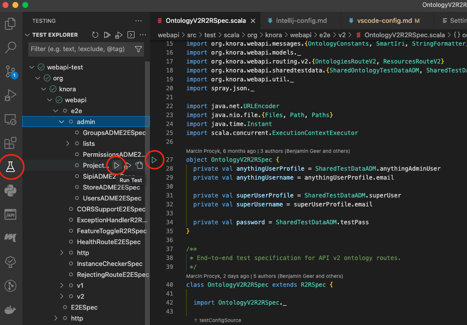

# Setup Visual Studio Code for development of DSP-API

To have full functionality, the [Scala Metals](https://scalameta.org/metals/) plugin should be installed.

Additionally, a number of plugins can be installed for convenience, but are not required. Those include but are by no means limited to:

- Docker - to attach to running docker containers
- Stardog RDF grammar - TTL syntax highlighting
- Lua
- REST client
- ...

## Formatter

As a formatter, we use [Scalafmt](https://scalameta.org/scalafmt/).
Metals automatically recognizes the formatting configuration in the `.scalafmt.conf` file in the root directory.
VSCode should be configured so that it austomatically formats (e.g. on file saved).

## Running Tests

The tests can be run through make commands or through SBT.
The most convenient way to run the tests is through VSCode.
Metals recognizes scalatest suits and lets you run them in the text explorer:

Or with the setting `"metals.testUserInterface": "Code Lenses"` directly in the text:

## Debugger

It is currently not possible to start the stack in debug mode.

Tests can be run in debug mode by running them as described above but choosing `debug test` instead of `test`.
